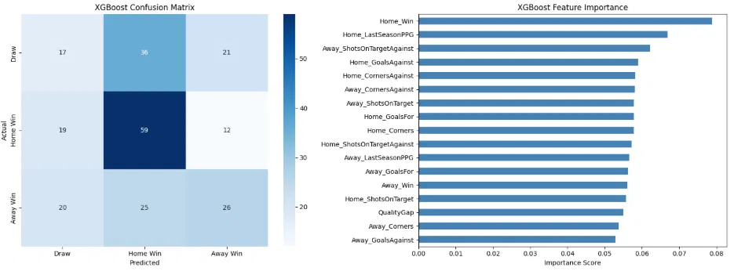

# Premier League Match Predictor

A machine learning pipeline that predicts Premier League match outcomes 
and simulates full-season standings via Monte Carlo simulation. I 
directed the build end to end — defining the approach, diagnosing 
issues in the model's output, and deciding what to fix and what to 
abandon — using AI-assisted development to implement it. Documented 
honestly below, including what didn't work.

## What it does
- Loads 3+ seasons of Premier League match data (goals, shots, corners)
- Builds rolling 5-match form features for every team
- Handles newly promoted teams by pulling their prior Championship season 
  stats, discounted for the step up in competition
- Trains an XGBoost classifier to predict Home Win / Draw / Away Win
- Runs a 5,000-iteration Monte Carlo simulation of the remaining season 
  to estimate each team's title, top-4, and relegation odds
- Includes an interactive head-to-head predictor

## How I validated it
Rather than trusting a single accuracy number, I designed a retrospective 
test: train on data up to January 2026, then have the model simulate the 
rest of the already-completed 2025/26 season — a season with a known, 
checkable outcome.

Results:
- Correctly predicted Arsenal as champion (92.5% confidence) — they won
- Correctly flagged all 3 relegated teams with high confidence 
  (Wolves 100%, Burnley 98.3%, West Ham 83.5%) — all three went down
- Missed the mid-table: predicted Man United ~8th (finished 3rd), 
  predicted Brighton near relegation risk (finished a comfortable 8th)

This told me something specific: the model separates the very best and 
worst teams well, but can't reliably rank the 10-15 teams in between — 
consistent with how volatile mid-table football actually is.

## Bug I identified: Aston Villa and recency bias
After pointing the model at the live 2026/27 season, I noticed Aston 
Villa — a team with a strong recent track record — predicted to finish 
16th. That didn't match what I know of the league, so I investigated.

Root cause: the model's "form" feature was a rolling average of only the 
last 5 matches. Early in a new season, that's a team's *entire* visible 
history to the model — a rough opening month looks identical to a 
genuinely weak team, with no memory of who they normally are.

Fix: added last season's points-per-game as a separate, stable feature — 
an anchor for "established level," independent of a small, noisy 
current-season sample. Result: Villa's predicted average finish improved 
from 14.9 to 11.5, and relegation risk dropped close to zero.

I then tested a more advanced version — blending last-season and 
current-season form with a decay weight, to explicitly model regression 
to the mean (the idea that strong teams with rough starts tend to 
recover, which I've observed watching the league for years). It improved 
Villa's case further but measurably hurt overall test accuracy 
(43.0% → 41.3%), so I reverted it. A well-reasoned hypothesis isn't 
automatically a model improvement — I tested it and the data said no.

## Fixing the model's blind spot for draws
The model initially identified draws almost by accident — 5-7% recall, 
meaning it caught roughly 1 in 15-20 actual draws. I addressed this two 
ways at once: added a "quality gap" feature (the difference in both 
teams' last-season PPG, since evenly matched teams draw more often), and 
weighted draws 2x during training.

Result: draw recall rose to 23%, a several-times improvement, with 
overall accuracy also improving to 43-45% depending on model type.

## A second bias I found, in the opposite direction: Brighton
Reviewing the live 2026/27 projections, I flagged Brighton's 99.2% 
top-4 probability as suspiciously high — more confident than even 
Arsenal (81.5%), the league's dominant team.

Investigation: Brighton's early-season form was genuinely excellent 
(10 points, +11 goal difference, best in the league) — but their 
last-season PPG was only 1.39, a mid-table level matching their actual 
8th-place finish. The model was over-trusting a small, hot early-season 
sample over their established level — the mirror image of the Aston 
Villa problem. The LastSeasonPPG anchor helps correct recency bias in 
one direction but doesn't fully offset an extreme early-season outlier 
in the other. This remains an open limitation.

## Checking for memorization
Before trusting any of this, I ruled out the model simply memorizing 
training data instead of learning real patterns — the same failure mode 
behind some flawed medical imaging AI (e.g., a skin cancer model that 
learned to detect rulers in photos rather than cancer). Comparing 
training accuracy to test accuracy on unseen data confirmed a small gap, 
indicating genuine generalization.

## Final live prediction — 2026/27 season (in progress)

| Pos | Team | Title % | Top 4 % | Relegation % | Avg Finish |
|---|---|---|---|---|---|
| 1 | Arsenal | 81.5 | 100.0 | 0.0 | 1.2 |
| 2 | Man City | 16.7 | 99.2 | 0.0 | 2.2 |
| 3 | Brighton | 1.1 | 86.1 | 0.0 | 3.6 |
| 4 | Man United | 0.8 | 89.6 | 0.0 | 3.5 |
| 5 | Brentford | 0.0 | 0.0 | 5.6 | 12.6 |
| 6 | Leeds | 0.0 | 0.5 | 1.6 | 10.6 |
| 7 | Liverpool | 0.0 | 5.8 | 0.0 | 7.1 |
| 8 | Everton | 0.0 | 0.0 | 0.7 | 9.7 |
| 9 | Hull | 0.0 | 0.0 | 29.3 | 15.7 |
| 10 | Newcastle | 0.0 | 0.0 | 5.2 | 12.8 |
| 11 | Chelsea | 0.0 | 0.0 | 3.9 | 7.9 |
| 12 | Ipswich | 0.0 | 0.0 | 16.8 | 14.4 |
| 13 | Nott'm Forest | 0.0 | 0.0 | 20.9 | 15.0 |
| 14 | Sunderland | 0.0 | 12.7 | 0.0 | 6.2 |
| 15 | Crystal Palace | 0.0 | 0.0 | 88.9 | 19.0 |
| 16 | Aston Villa | 0.0 | 0.2 | 6.3 | 12.4 |
| 17 | Bournemouth | 0.0 | 0.1 | 3.3 | 11.8 |
| 18 | Coventry | 0.0 | 0.0 | 79.1 | 18.5 |
| 19 | Fulham | 0.0 | 1.0 | 0.8 | 9.5 |
| 20 | Tottenham | 0.0 | 0.0 | 41.2 | 16.5 |

This is a genuine forecast with an unknown outcome, worth checking back 
on once the season concludes in May 2027 — including whether Brighton's 
flagged over-confidence turns out to be justified or not.

## Honest limitations
- ~43-45% accuracy on 3-way outcomes (vs ~33% random baseline)
- Strong at the extremes, weak in the mid-table
- Two identified, partially-unresolved biases: undervaluing strong teams 
  with rough starts (Villa-type), and overvaluing weak teams with hot 
  starts (Brighton-type)
- Built on only ~2.5-3 seasons of data — limits the model's independent 
  sense of "team identity"
- No Expected Goals, injury data, or squad-spending data

## What I'd do with more time
- Expected Goals instead of raw goals
- Head-to-head history between specific team pairs
- More historical seasons
- A feature capping how much an extreme early-season sample can move 
  predictions, to address the Brighton-type bias directly
